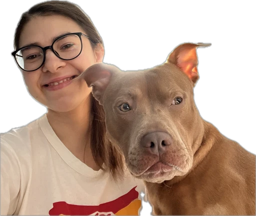

# Hello! 👋 My name is Mariia Ermishina (_Masha_)

<!-- The words "Mariia Ermishina" is highlighted due  
to the spell-checking feature in the editor.  
It is not an error but a proper noun that is not recognized  
by the default dictionary. -->

Welcome to my GitHub profile! Here, you can find projects that  
reflect my knowledge, interests, and passion for creating  
innovative solutions in energy efficiency and data analytics.

## 🧑‍💻 About Me

- 🎓 Education:
  - Master's degree in Renewable Energy (with honors) from  
  Moscow Power Engineering Institute [MPEI](https://mpei.ru/lang/en/Pages/default.aspx)
  - General Assembly courses in Data Analytics [GA](https://generalassemb.ly/)
  - Current student at MIT Foundational Track [MIT](https://emergingtalent.mit.edu/)
  
<!-- The words "MPEI" is highlighted due  
to the spell-checking feature in the editor.  
It is not an error but a proper noun that is not recognized  
by the default dictionary. -->

- 💡 MIT: My Path in Technology  
  I am a student of the Foundational Track at MIT, and it has  
  been an incredible experience so far! I’ve already gained a  
  lot of knowledge and truly enjoyed the lessons and lectures.  
  Every class opens up new perspectives and helps me see  
  technology in a whole new way.

  I’m still at the beginning of my journey, and many technical  
  things feel challenging and even scary. But being part of this  
  environment is so motivating! It pushes me to grow and keep  
  moving forward, despite the difficulties.

  As a beginner in IT, things can be really tough for me. But the  
  support and encouragement from our amazing teachers make  
  a big difference. Their inspiring words give me confidence and  
  help me explore new opportunities.

---

## 🔧 Skills

- Programming: Python
- Data Analytics: Tableau, Excel

---

## 🚀 My Project

### [MEW Energy](https://mewenergy.com/)

_Goal_: To develop consulting services for improving energy efficiency and  
reducing energy costs.  
_Description_: I am building a company that helps people optimize their energy  
consumption, lower their energy expenses, and implement modern solutions  
like solar panels, battery systems, and smart homes.

---

## 🌟 Hobbies

- 🌿 Nature: I love spending time in nature—it’s my source of inspiration  
  and  energy. Walks in the forest or trips to the seaside help me relax and  
  come up with new ideas.
- 🐾 Animals: I have a special love for animals and actively support projects  
  focused on protecting wildlife and pets.
- 🌏 World Cultures: I enjoy learning about different cultures, their  
  traditions, and languages. Living in New York has given me the opportunity  
  to meet amazing people from Bangladesh, Africa, Latin America, and China.  
  I love sharing experiences and exchanging traditions with them.

---

## 📫 How to Reach Me

- 📧 Email: [ermishina.m7@gmail.com](mailto:ermishina.m7@gmail.com)
- 🌐 LinkedIn: [MY Profile](https://www.linkedin.com/in/mariia-ermishina-33b47628a/)
- 📱 Instagram: [MEWEnergy_](https://www.instagram.com/mewenergy_/)

---

> Thank you for visiting!  
I’m always open to new connections and collaborations.  
Feel free to reach out if you have any ideas, suggestions, questions  
or just interesting to talk about energy and technology!
